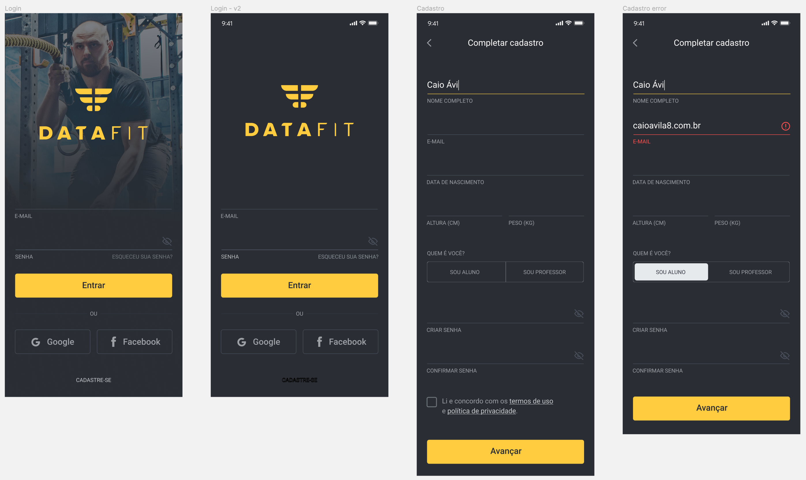
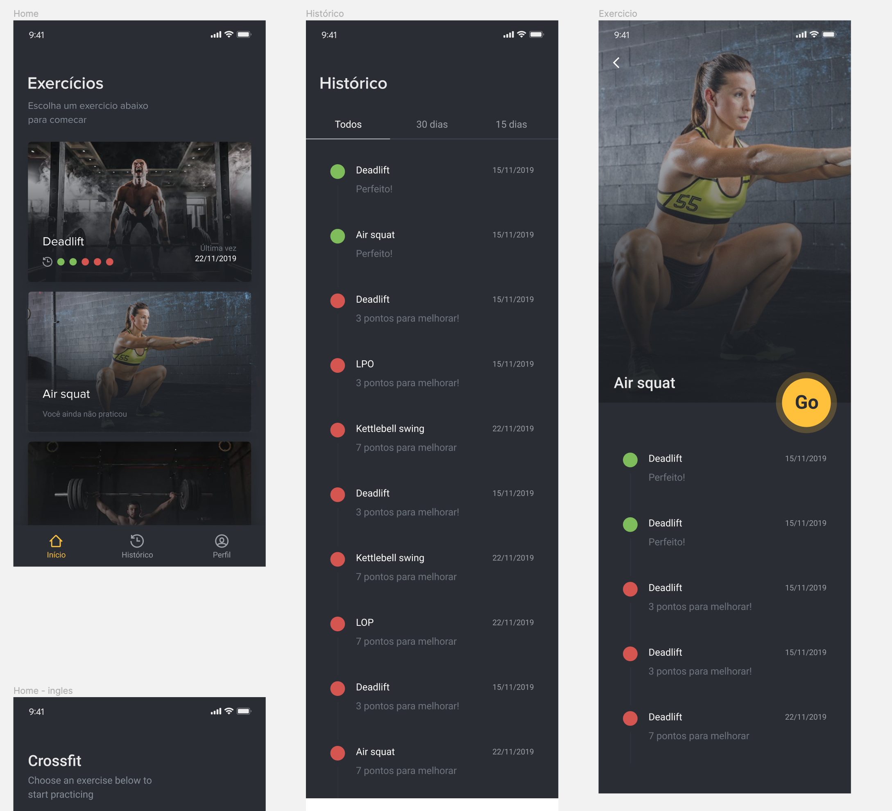
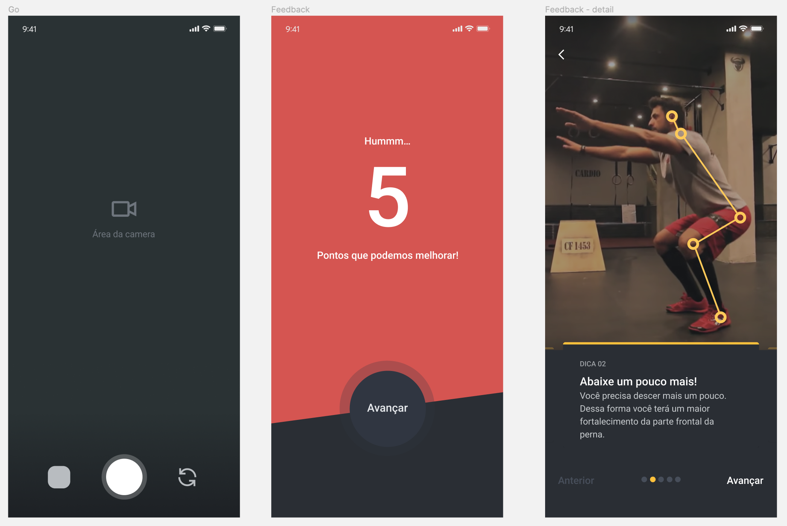
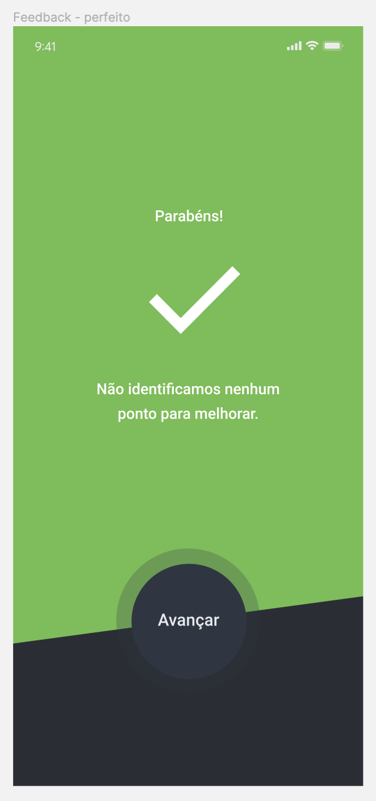

# DataFit React Native app

DataFit was a side project that I was involved in last year, and I have decided to open source the first screens so that I can add to my portfolio a prove that I know how to build an React Native app.

- [DataFit React Native app](#datafit-react-native-app)
  - [Screens](#screens)
    - [Sign up](#sign-up)
    - [Exercises](#exercises)
    - [Analyzer](#analyzer)

## Screens

### Sign Up

### Exercises

### Analyzer

